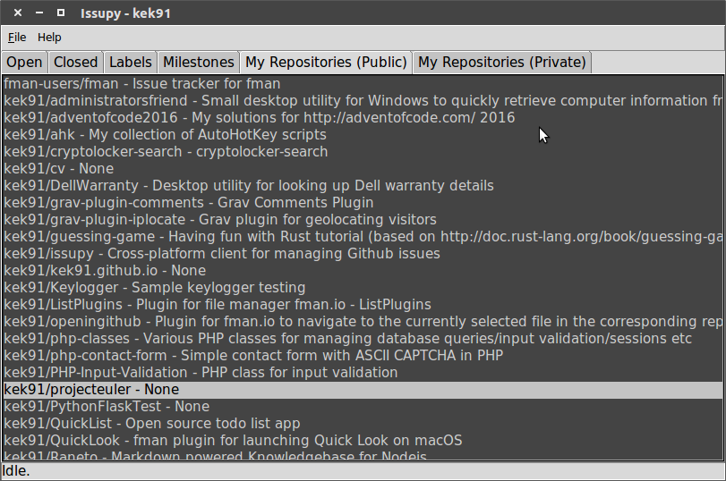
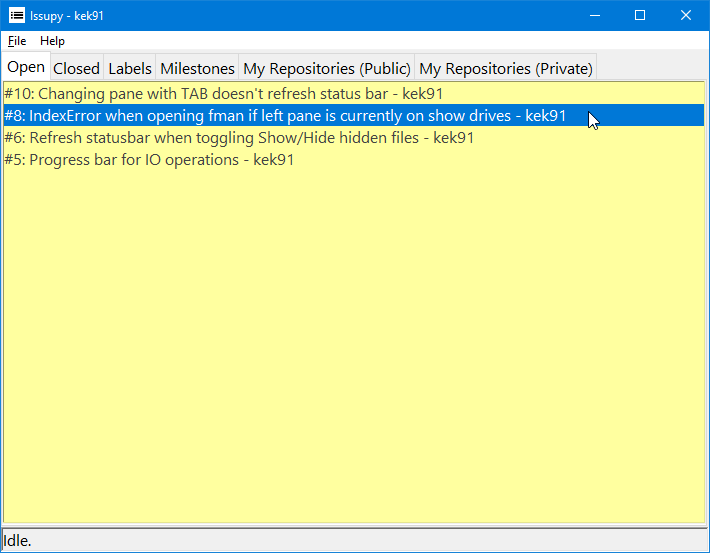

# Issupy

Cross-platform client for managing Github issues.

Work in progress...

## Install instructions

- Clone repo
- `python3 main.py`

## Features

- Compatible with Windows, Linux and MacOS (MacOS has not been tested but should work in theory)
- Lightweight/fast (compared to clunky web apps and bloated Electron apps)
- Simple UI with some minor color/theme tweaking supported
- Caches issues which has not been modified to speed up load time

## Known issues

- Ugly GUI

I know, it's based on the Tkinter toolkit which is s a little lacking compared to modern frameworks. 
The GUI has not been a priority though, I just need a desktop app for my Linux and Windows computers for managing my project issues with no bloat.

- Use Table instead of List widget for listing all issues/items

The list view is messy because the text is not aligned properly, so this will be implemented at some time. Tkinter has no table widget though so the "table" has to be artificially made by making a shit ton of grids with textboxes/labels inside.

**v0.0.1**

| Ubuntu        | Windows |
| ------------- |:-------------:|
|  |  |
